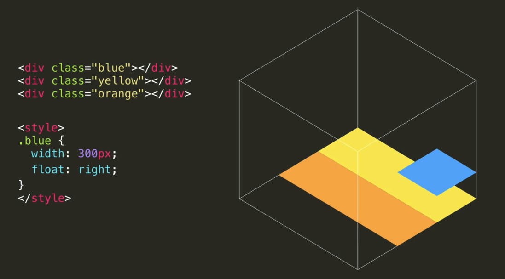
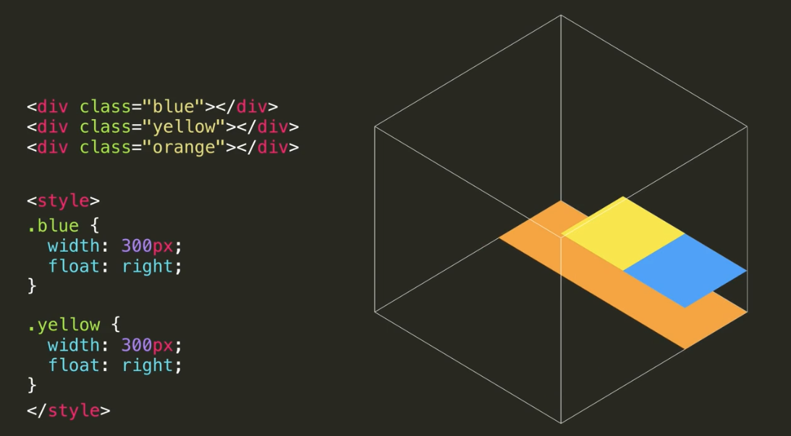

# 📎 01. Box Model
## margin과 padding
```
.p1 {
  // 요소 간의 여백
  //  top, right, bottom, left
  margin: 100px 10px 100px 10px;

  // 박스 테두리와 내용의 여백
  // top, right, bottom, left
  padding: 10px, 50px, 10px, 50px;
}
```
margin으로 가운데 정렬
```
.p1 {
  margin: 0 auto;
}
```

## width와 height
창의 크기가 변화에 따른 박스의 크기 변화 조절
```
.p1 {
  width: 1000px;
  height: 200px;

  // 최댓값과 최솟값 설정 - 창의 크기 변화에 따른 박스 크기의 변화를 조절
  min-width: 500px;
  min-height: 100px;
}
```

## overflow
- `: visible` : 넘치는 내용을 그대로 보여줌 (기본 설정)
- `: hidden` : 넘치는 내용을 숨김
- `: scroll` : 항상 스크롤바 생성
- `: auto` : 내용이 넘치는 경우에만 스크롤바 생성

## border
```
.p1 {
  // 테두리의 굵기(width), 선의 종류(style), 테두리의 색(color)
  border: 2px solid #4d9fff;
}
```
선의 종류
> solid(직선), dotted(점선), dashed(파선)

각 테두리마다 다른 설정 적용 가능
> border-top, bottom, left, right

테두리 없애기
> `border: none;` 또는 `border: 0;`

## 박스 꾸미기
- `border-radius` : 테두리 둥글게
- `background-color`: 배경색
- `box-shadow` : 그림자
```
.p1 {
  // 가로 위치, 세로 위치 - 양수 : 오른쪽, 아래 / 음수 : 왼쪽, 위
  box-shadow: 50px 30px;

  // 그림자 흐리게, 크기, 색 설정
  box-shadow: 50px 30px 50px 10px red;
}
```

## box-sizing
- `content-box;`  
`width`와 `height`가 실제 내용의 크기를 결정
실제 박스 크기는 (width/height) + padding + border  
- `border-box;` (모든 태그에 적용 권장)
전체 박스의 크기를 width와 height로 고정해줌

## 배경이미지 넣기
```
.div {
  background-image: url("이미지파일명(상대경로 포함)");
  // cover : 사진의 비율을 유지, 박스를 꽉 채움
  background-size: cover;
  // position : 배경이미지의 위치(기준점) 설정
  // 사진이 잘리는 경우 기준점을 중점적으로 보여줌
  background-position: center center;
}
```

# 📎 02. CSS 제대로 활용하기
## 자식과 직속 자식
```
// 'div1' 클래스를 갖고 있는 요소의 자식 중 모든 <i> 태그
.div1 i {
  color: orange;
}

// 'div1' 클래스를 갖고 있는 요소의 직속 자식 중 모든 <i> 태그
.div1 > i {
  color: orange;
}
```

## 복수 선택
```
// 'two' 클래스를 가지고 있는 태그 모두와 'four' 클래스를 가지고 있는 태그 모두 선택
.two, .four {
  color: orange;
}
```

## 여러 조건
```
// 'outside' 클래스를 갖고 있으면서 'one' 클래스도 갖고 있는 태그
.outside.one {
  color: blue;
}
```

## Pseudo-class (가상 클래스)
콜론(:)으로 가상 클래스 선택

1. n번째 자식
```
// .div1의 자식인 <p> 태그 중 3번째
.div1 p:nth-child(3) {
  color: blue;
}
```

2. 마우스 오버 (hover)
```
// 마우스가 <h1> 태그에 올라갔을 때
h1:hover {
  color: green;
}
```

## CSS 상속
태그와 속성에 따라 부모 요소의 속성이 자식들에게 적용되기도 함  
> 상속되는 속성
color, font-family, font-size, list-style, text-align

위 속성들이 항상 상속되는 건 아님  
> 상속되지 않는 태그 : a

# 📎 03. Display
## Display 속성
각 요소마다 display 값이 정해져 있지만 css 코드로 변경 가능  
> `inline-block` 으로 변경하기
```
i {
  display: inline-block;
  width: 200px;
}
```

## 가운데 정렬
> inline 또는 inline-block 요소
```
.container {
  text-align: center;
}
```
> block 요소
```
.block-element {
  margin-left: auto;
  margin-right: auto;
}
```

# 📎 04. Positioning
## relative position
- static : 원래 있어야 할 위치 (`position`의 기본값)  
- relative : 원래 있어야 할 위치를 기준으로 위치 설정

```
// css 코드
b {
  position: relative;
  // 원래 위치에서 top, left에 간격 두기
  top : 30px;
  left: 30px;
}
```
> relative에서의 간격과 margin의 차이점  

원래 위치의 공간은 비어지고 설정한 위치에 요소가 나타남  
다른 요소들이 간격의 영향을 받지 않아서 겹치는 레이아웃이 가능함

## fixed position
브라우저를 기준으로 위치 설정
```
// css 코드
b {
  position: fixed;
  // 브라우저에서 top, left에 간격 두기
  top : 30px;
  left: 30px;
}
```

## absolute position
가장 가까운 포지셔닝이 된 조상 요소를 기준으로 위치 설정
> 포지셔닝이 된 요소  
static(기본)을 제외한 relative, fixed, absolute position을 의미

# 📎 05. Float
## float
요소를 공중에 띄워서 원래 차지하던 공간을 빈공간으로 만들기  
아래 있던 요소가 빈공간을 채우게 되면서 겹쳐보일 수 있음  
단, inline이나 inline-block 요소는 원래 있던 요소의 공간에 들어갈 수 없음



사용 목적
> 기사나 신문처럼 그림이 글자 사이에 둘러싸이는 레이아웃 표현  
사진과 글자 사이에 여유를 두려면 그림에 여백 두기

## multiple float
여러 요소를 float할 때 먼저 float된 요소와 충돌하는 경우 그 자리에서 멈춤  
더 이상 같은 줄에 float할 공간이 없으면 밑에 줄로 아동  
브라우저의 가로 길이에 따라 레이아웃이 달라질 수 있음



사용 목적
> 그리드(Grid) 레이아웃

## clear
`float`와 함께 쓰이는 속성  
float에서의 줄바꿈 역할  
```
#div1 {
  float: right;
}
#div2 {
  float: right;
  // 오른쪽에 아무런 요소가 없도록 함
  // div1 밑에 줄 오른쪽으로 배치
  clear: right;
}
```
사용 목적
> 어떤 `div` 내의 요소를 모두 공중에 띄우면 해당 `div`의 `height`를 0으로 받아들임  
> 브라우저 `width`를 조절함에 따라 배치가 불규칙해짐 (ex. 밑에 텍스트 요소를 추가한 경우)
```
// html
<div class="clearfix"></div>

// css
.clearfix {
  clear: left;
}
```
> `.clearfix`가 그리드 레이아웃이 끝나는 하단에 위치하게 됨  
> `.clearfix`를 포함하기 위해 `div`의 `hieght`가 설정됨  
> 브라우저의 width를 조절해도 원하는 대로 레이아웃이 유지됨