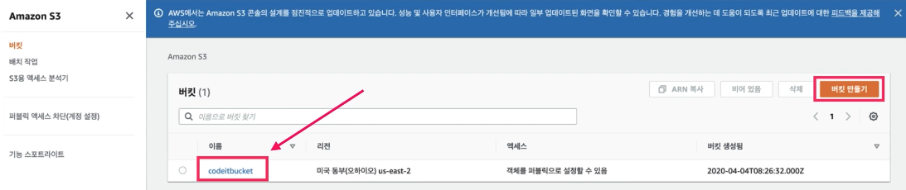
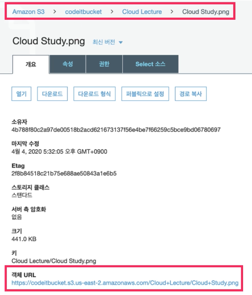

## 01. AWS 대표 서비스 소개

### Elastic Compute Cloud (EC2)
컴퓨팅 기능을 갖고 있는 자원을 할당받는 서비스  
= OS만 설치된 가상 머신(인스턴스)을 빌려주는 서비스

### Elastic Block Store (EBS)
EC2는 저장 장치가 없는 컴퓨터, EBS는 데이터를 저장하는 저장 장치  
EC2를 생성하면 기본적으로 EBS 하나가 함께 장착됨  
하나의 EC2에 여러개 EBS 장착 가능

### Simple Storage Store (S3)
사진이나 동영상 같은 파일을 저장하는데 최적화된 서비스

### EBS vs S3
EBS : Block Storage  
윈도우의 C 드라이브나 유닉스 계열의 root 디렉토리  
원하는 대로 폴더와 파일들을 생성 / 삭제  

S3 : Object Storage  
Block Storage 위에 고객이 더 편하게 사용할 수 있도록 층을 추가한 저장소  
웹페이지 화면이나 HTTP 화면을 통해 폴더와 파일을 생성 / 삭제  

  
⬆️ bucket 단위로 폴더와 파일 관리  
 

  
⬆️ codeitbucket 안에 Cloud Lecture 폴더 안에 Cloud Study.png 파일 저장

### Relational Database Service (RDS)
데이터를 저장하는 DB 서버를 제공

### Auto Scaling
AWS가 자동으로 실시간 상황에 맞게 인스턴스 개수를 조절해주는 서비스  
