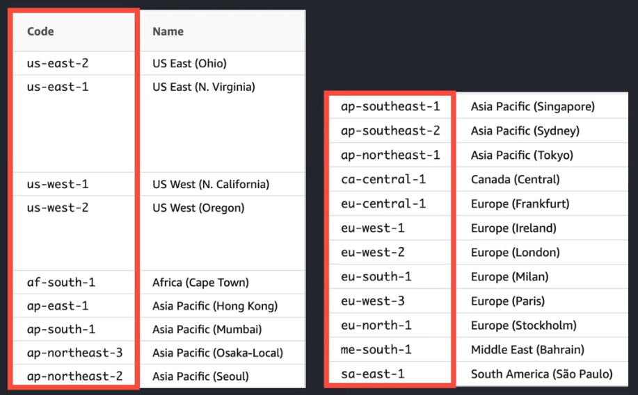

## 01. AWS 대표 서비스 소개
해당 문서는 코드잇의 클라우드 컴퓨팅 강의를 기반으로 작성되었습니다.

### Elastic Compute Cloud (EC2)
컴퓨팅 기능을 갖고 있는 자원을 할당받는 서비스  
= OS만 설치된 가상 머신(인스턴스)을 빌려주는 서비스

### Elastic Block Store (EBS)
EC2는 저장 장치가 없는 컴퓨터, EBS는 데이터를 저장하는 저장 장치  
EC2를 생성하면 기본적으로 EBS 하나가 함께 장착됨  
하나의 EC2에 여러개 EBS 장착 가능

### Simple Storage Store (S3)
사진이나 동영상 같은 파일을 저장하는데 최적화된 서비스

### EBS vs S3
EBS : Block Storage  
윈도우의 C 드라이브나 유닉스 계열의 root 디렉토리  
원하는 대로 폴더와 파일들을 생성 / 삭제  

S3 : Object Storage  
Block Storage 위에 고객이 더 편하게 사용할 수 있도록 층을 추가한 저장소  
웹페이지 화면이나 HTTP 화면을 통해 폴더와 파일을 생성 / 삭제  

  
⬆️ bucket 단위로 폴더와 파일 관리  
<br>

  
⬆️ codeitbucket 안에 Cloud Lecture 폴더 안에 Cloud Study.png 파일 저장

### Relational Database Service (RDS)
데이터를 저장하는 DB 서버를 제공

### Auto Scaling
AWS가 자동으로 실시간 상황에 맞게 인스턴스 개수를 조절해주는 서비스  

## 02. Region과 Availability Zone

### Data Center
물리적 컴퓨터가 수천수만대 모여있는 곳

### Region
AWS의 데이터 센터가 있는 지역  
  

⬆️ 왼쪽 : aws 공식 region 명징, 오른쪽 : 전세계 region 이름  


region 선택의 중요성
- 네트워크 속도 차이 
  ex) 미국에 있는 고객을 대상으로 서비스를 하려면 서울이 아닌 미국에 있는 region을 선택하기  
- 법/제도적 이유
  ex) 고유식별정보 또는 개인신용정보를 처리하기 위한 클라우드서비스의 서버는 국내에 설치해야 한다
- 서비스의 차이
  region마다 제공되는 AWS의 서비스가 다르다

### 가용 영역 (Availability Zone)

하나의 region에는 2~3개의 AZ가 존재 (Multi-AZ)  
물리적인 데이터센터를 여러개 결합해서 논리적으로 하나로 만든 데이터센터  
가용성을 보장하기 위해 지리적으로 분리된 각각의 데이터센터

```
가용성 : 어떤 상황에서든 특정 서비스를 이용하는데 어려움이나 불편함이 없는 성질  
가용성을 유지하지 못한 사례 : 메신저 서비스가 설 명절과 같이 traffic이 몰릴 때 작동하지 못한 경우  

천재지변이 일어난 경우에도 가용성은 100% 만족되어야 한다.
```
