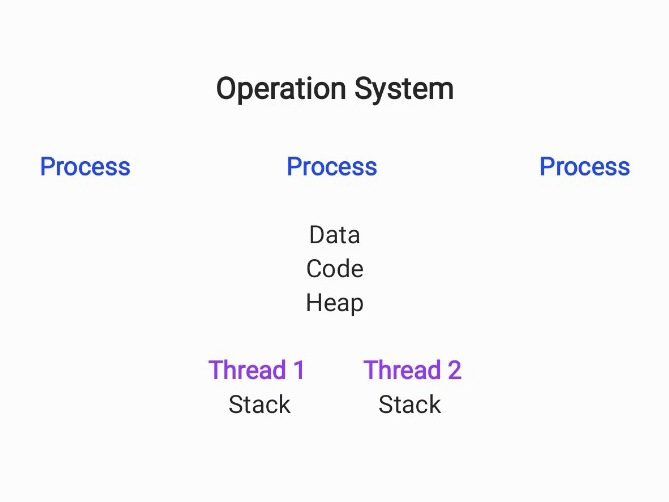

# 빅데이터처리론
## 01. Data Era
### Process와 Thread
프로세스 (Process)
- 컴퓨터에서 연속적으로 실행되고 있는 컴퓨터 프로그램
- 운영체제로부터 시스템 자원을 할당받는 작업의 단위
- 메모리에 올라와 실행되고 있는 프로그램의 인스턴스 (독립적인 개체)

쓰레드 (Thread)
- 프로세스 내에서 실행되는 여러 흐름의 단위
- 프로세스가 할당받은 자원을 이용하는 실행의 단위

### Process와 Thread의 특징

**프로세스**  
운영체제로부터 각각 독립된 메모리 영역(Code, Data, Stack, Heap)을 할당받음  
기본적으로 하나의 프로세스 - 하나의 쓰레드(Main Thread)가 같이 생성됨  
각 프로세스는 별도의 주소 공간에서 실행, 한 프로세스는 다른 프로세스의 변수나 자료에 접근 불가

> IPC (Inter-Process Communication)  
한 프로세스가 다른 프로세스의 자원에 접근하려면 프로세스 간 통신(IPC)을 사용해야 함

**쓰레드**  
프로세스 내에서 각각 Stack만 따로 할당받고 Code, Data, Heap 영역은 공유  
같은 프로세스 내의 쓰레드끼리 주소 공간이나 자원을 공유하면서 실행됨  
한 쓰레드가 프로세스 자원을 변경하면 이웃 쓰레드도 변경 결과 즉시 확인 가능  

### multiProcess와 multiThread의 차이
#### 멀티 프로세스
**멀티 프로세싱**  
하나의 응용프로그램을 여러 개의 프로세스로 구성하여 각 프로세스가 하나의 작업을 처리하도록 하는 것  

**장점**  
여러 자식 프로세스 중 하나에 문제 발생 시 다른 프로세스는 영향을 받지 않음  

**단점**  
Context Switching 과정에서 캐쉬 메모리 초기화가 진행되고 많은 시간이 소모되는 등 오버헤드 발생  
프로세스 사이의 어렵고 복잡한 통신 기법  

> Context Switching 이란 ?  
CPU에서 여러 프로세스를 돌아가면서 작업을 처리하는 것  
동작 중인 프로세스가 대기를 하면서 해당 프로세스의 상태 보관, 대기 중이던 다음 프로세스가 동작하면서 이전에 보관했던 프로세스의 상태를 복구함

#### 멀티 쓰레드
**멀티 쓰레딩**  
하나의 응용프로그램을 여러 개의 쓰레드로 구성하고 각 쓰레드가 하나의 작업을 처리하도록 하는 것  
대표적인 멀티 쓰레드 응용 프로그램 : 웹 서버

**장점**  
프로세스를 생성하여 자원을 할당하는 시스템 콜이 줄어 자원의 효율성 증대  
프로세스 간 통신보다 쓰레드 간 통신이 비용이 적으므로 통신 비용 감소  
쓰레드 사이의 작업량이 작아 Context Switching이 빠름  

**단점**
주의 깊은 설계 필요  
단일 프로세스 시스템인 경우 효과를 기대하기 어려움  
하나의 쓰레드에 문제 발생 시 전체 프로세스가 영향을 받음  

## 멀티 코어
**개념**
CPU는 두 개 이상의 독립 코어를 단일 직접회로로 이루어진 하나로 통합하여 사용  

**특징**
각 코어는 멀티스레딩과 같은 최적화를 독립적으로 수행  
코어의 개수에 따라 그 수 만큼 스레드를 동시에 처리할 때 효율적으로 동작  
코어는 적은 것보다 많은 것이 좋음  
