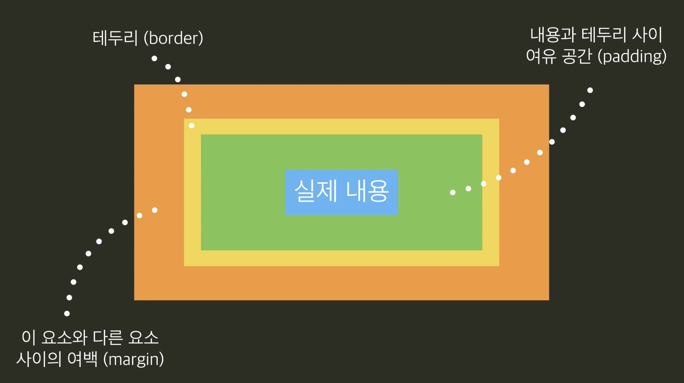

# 📎 01. Box Model
## Box 모델 소개
html의 모든 요소는 박스의 형태  
[박스 모델 css 스타일링](https://github.com/jjungyujin/TIL/blob/main/CSS/CSS_KeyPoint.md)

## overflow
박스의 크기 설정에 따라 내용이 박스 크기를 초과하기도 함  
overflow 속성으로 넘치는 내용 처리 가능

