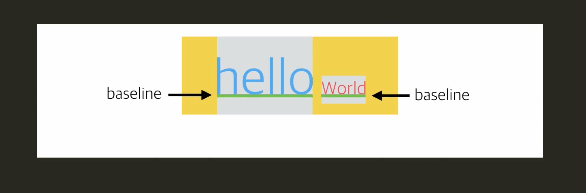

# 📎 01. Box Model
## Box 모델 소개
html의 모든 요소는 박스의 형태  
[박스 모델 css 스타일링 -  01](https://github.com/jjungyujin/TIL/blob/main/CSS/CSS_KeyPoint.md)


## overflow
박스의 크기 설정에 따라 내용이 박스 크기를 초과하기도 함  
overflow 속성으로 넘치는 내용 처리 가능

# 📎 02. Display
## display 속성
inline, block, inline-block, list-item, table, flex, none 등  
모든 요소는 딱 하나의 display 값을 가지며 대부분 inline과 block 중 한 가지

1. inline - `<span>`, `<a>`, `<b>`, ``, `<button>`  
다른 요소들과 같은 줄에 머무르려고 하는 성향  
가로 길이는 필요한 만큼만 차지하는 성향 (박스 크기가 자동 결정)  
딘, ``는 크기 설정이 가능한 inline 요소

2. block - `<div>`, `<h1>`, `<p>`, `<ul>`, `<li>`  
새로운 줄에 가려는 성향  
가로 길이를 최대한 많이 차지하려는 성향

3. inline-block  
다른 요소들과 같은 줄에 있으면서 박스 크기 설정이 가능  
[css로 display 설정하기 - 03](https://github.com/jjungyujin/TIL/blob/main/CSS/CSS_KeyPoint.md)

inline과 inline-block 요소의 가장 큰 특징 : 해당 요소를 텍스트처럼 다룰 수 있음

## 다양한 링크
> 텍스트가 아닌 요소 노드에 링크를 연결  
```
<a href="가고 싶은 주소"> <링크를 연결할 요소> </a>
```

> 여러 요소를 링크와 연결  
```
// html - <div>를 <a>로 변경
<a class="google=link" href="https://google.com" target="_blank">
  
  <h1> </h1>
  <p> </p>
</a>

// css
.a {
  // a의 display 변경
  display: block;

  // 텍스트 링크 기본 스타일 제거
  color: black;
  text-decoration: none;
}
```

## Baseline
inline 요소들은 각 박스의 baseline들이 맞춰져 정렬됨  

> 텍스트의 baseline



> 이미지의 baseline : 이미지의 하단  

> inline-block의 baseline  
`<div>`로 묶인 여러 요소를 inline-block으로 설정한 경우 마지막 요소의 baseline에 맞춤  

## vertical-align
기본값 : baseline  
그 외 : top, middle, bottom

# 📎 03. List
## list 태그
1. `<ol>`  
순서가 있는 리스트 (Ordered List)   
순서대로 `<li>` (list item)에 번호를 부여해서 출력함
```
<ol>
  <li>집 청소</li>            // 1. 집 청소
  <li>영어 단어 외우기</li>     // 2. 영어 단어 외우기
</ol>
```
> type 속성
```
<ol type="a">
  <li>집 청소</li>            // a. 집 청소
  <li>영어 단어 외우기</li>     // b. 영어 단어 외우기
</ol>

<ol type="i">
  <li>집 청소</li>            // i. 집 청소
  <li>영어 단어 외우기</li>     // ii. 영어 단어 외우기
```

2. `<ul>`  
순서가 없는 리스트 (Unordered List)  
`display: list-item;`으로 설정되어 있음 ([css로 리스트 스타일링 - 06](https://github.com/jjungyujin/TIL/blob/main/CSS/CSS_KeyPoint.md))  

> [ul을 이용한 웹 페이지의 네비게이션 바 만들기](https://github.com/jjungyujin/TIL/blob/main/HTML/web_nav.htmlx)