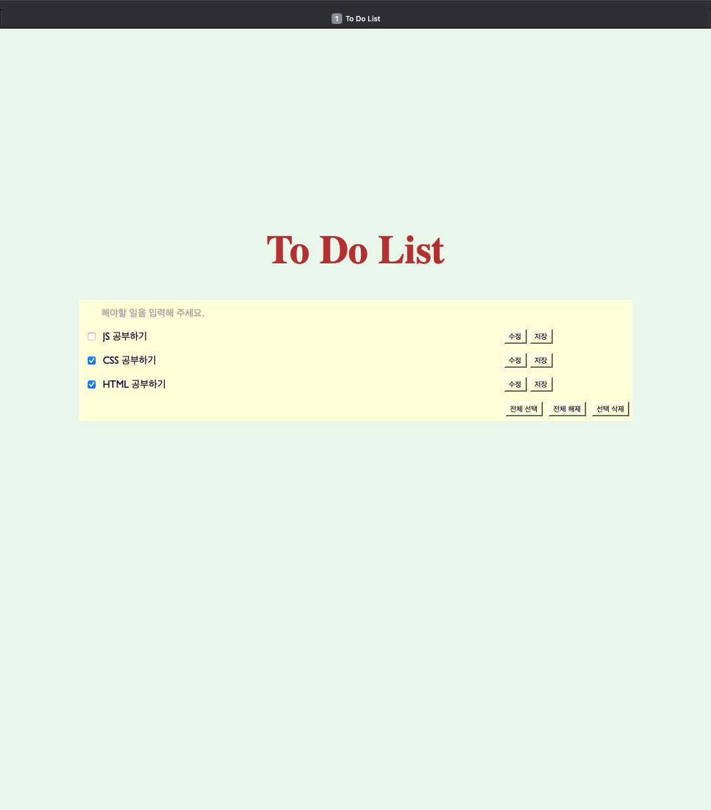
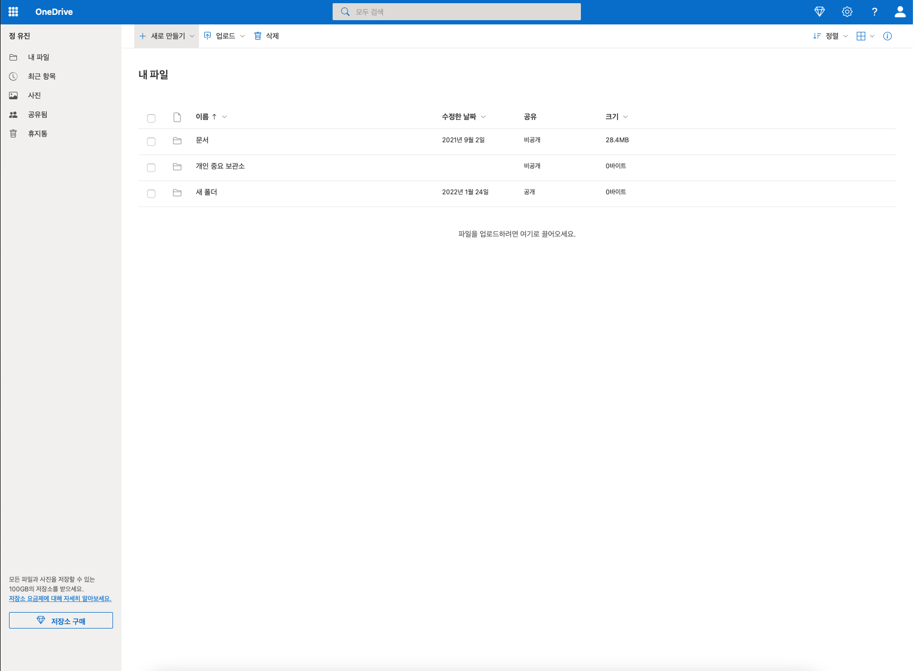

# 클라이언트(브라우저)와 서버의 HTTP 통신 구조
브라우저 👉🏻 서버 : HTTP 요청 (axios)  
서버 👉🏻 DB : 데이터 접근 (Spring, Node.js, Django)  
서버 👉🏻 브라우저 : HTTP 응답

# First Web Page
## [To Do List](https://github.com/jjungyujin/TIL/tree/main/webProgramming/to_do_list)

# Clone Coding
## [Onedrive](https://github.com/jjungyujin/TIL/tree/main/webProgramming/onedrive)
